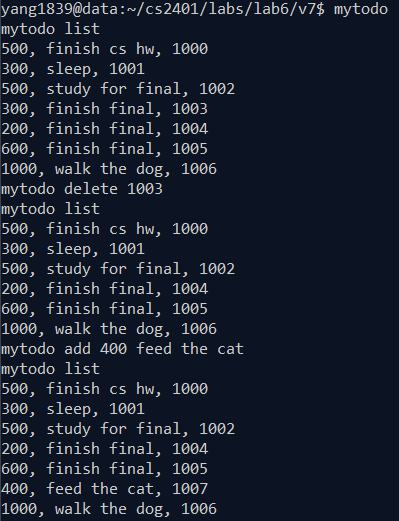

# MyTodo

Add your task using command-line arguments.
Type: "mytodo" to activate
Type: "mytodo add *task priority* *task description*" to add task
Type: "mytodo list" to list tasks in order of priority
Type: "mytodo delete *taskNum*" to delete the task

Example: 

